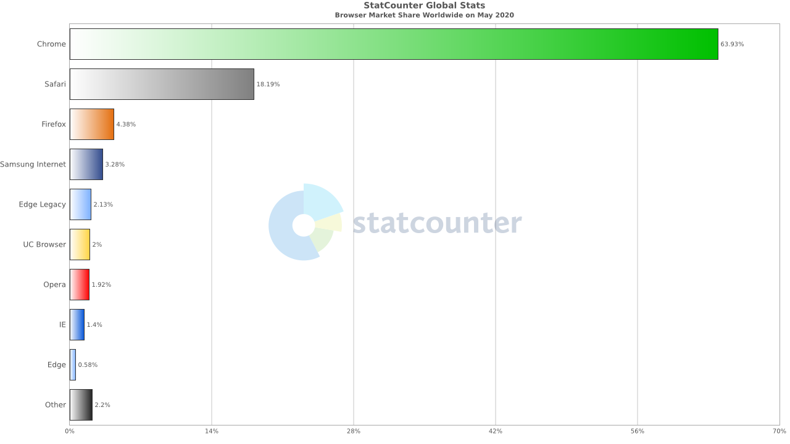
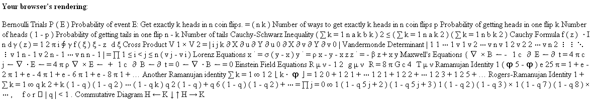
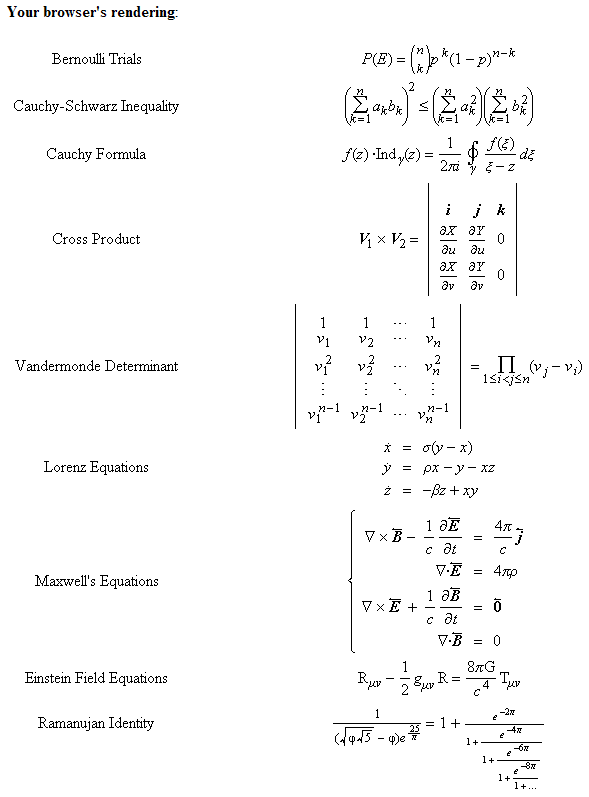

My first language was C++. I had full access to program the underlying hardware down to assembly instructions. When I learned HTML 4, it felt severely limiting and I understood why Flash was the superior web technology for complex sites, games, and videos.

<figure>

<figcaption>Anyone remember this guy?</figcaption>
</figure>

In the year 2020, browsers can be programmed to do nearly any task. This multipart series will assume you know what [HTML, CSS, and JS do](https://developer.mozilla.org/en-US/docs/Web/Reference) and come from a programming background that doesn't require hand-holding for hello world.

## The big 3

The [browser wars](https://en.wikipedia.org/wiki/Browser_wars) have mostly ended with 3 victors having 86% market share: Chrome, Safari, and Firefox.

<figure>

<figcaption>Across desktop and mobile, Chrome is the clear winner.</figcaption>
</figure>

When you create webpages, these are the browsers visitors will be using. Each has its own quirks, but if you stick to the W3C's standards for HTML5 you won't run into compatibility problems.

## The W3C and you

Each browser implements most [W3C standards](https://www.w3.org/standards). Some like JSON have been hits, others like [ontologies](https://www.w3.org/standards/semanticweb/ontology) have been flops. Some like [MathML](https://www.w3.org/standards/webdesign/math) have been properly implemented in some browers, but not others.

<figure>

<figcaption>

Unlike other popular rendering engines, Chrome's Blink does not render MathML properly and there's been an [open issue since 2009](https://bugs.chromium.org/p/chromium/issues/detail?id=6606).

</figcaption>
</figure>

<figure>

<figcaption>Internet explorer 7's old Trident engine implements MathML.</figcaption>
</figure>

The parts that are most important to writing real web pages are [the web design standards for HTML, CSS, and JS](https://www.w3.org/standards/webdesign). While you can work around things like MathML with JavaScript solutions, you can't workaround the core HTML, CSS, and JS specs.

### HTML standards

HTML is king. Released in January 2008, [HTML 5](https://developer.mozilla.org/en-US/docs/Web/Guide/HTML/HTML5) is the latest standard that defines valid markup for a browser. Valid markup is simply a string that can be transformed into DOM nodes by a browser. Thankfully, the [HTML5 specification](http://www.w3.org/TR/html5) provides a detailed description of how to parse HTML that is fairly consistent across browsers.

HTML 5 added support for many new elements and there are now [100s of elements](https://developer.mozilla.org/en-US/docs/Web/HTML/Element) you can use to render content.

### CSS standards

CSS 
