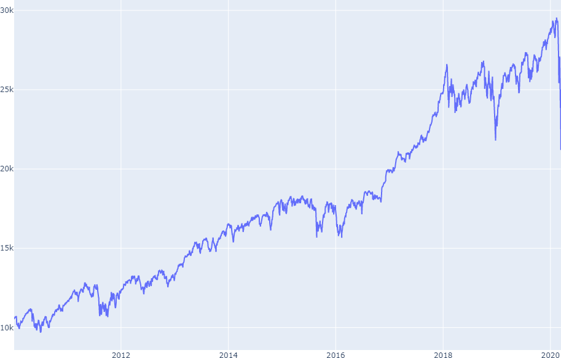
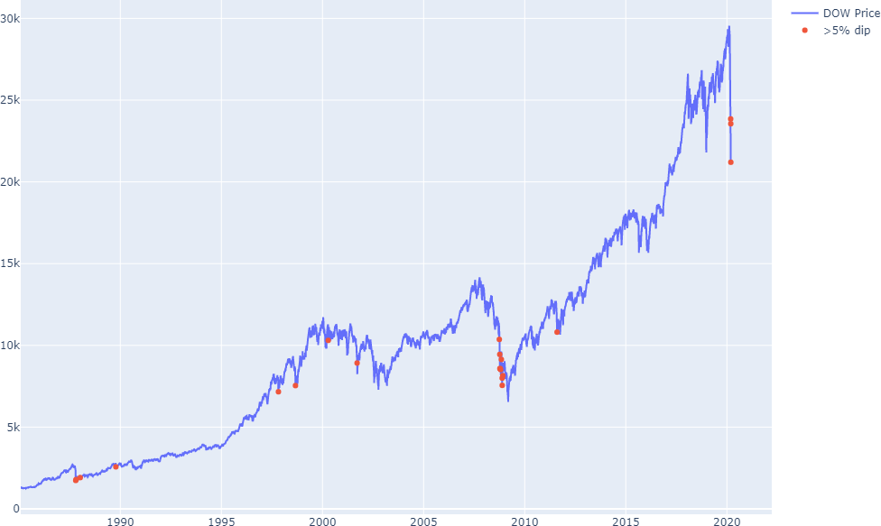

With all the [Coronavirus panic](https://www.usatoday.com/story/news/politics/2020/03/13/coronavirus-national-emergency-questions-answers-trump/5026463002/) the DOW has been falling off a cliff the past few days:

<figure>
  
  <figcaption>DOW plummetting to $21k based on <a href="https://finance.yahoo.com/quote/%5EDJI/history?period1=475804800&period2=1584144000&interval=1d&filter=history&frequency=1d">Yahoo finance data.</a> Click the image for an interactive full-size plot.</figcaption>
</figure>

Which raises a valid question: if you're sitting on some cash should you buy a index fund like the DOW?

## Let's backtest

This isn't the first time the DOW has dipped more than 5%. It's happened 18 times before 2020:

Occurrence | Date       | Dip %
:--------- | :--------- | ----:
         1 | 1987-10-19 | 22.61
         2 | 1987-10-26 |  8.03
         3 | 1988-01-08 |  6.85
         4 | 1989-10-13 |  6.90
         5 | 1997-10-27 |  7.18
         6 | 1998-08-31 |  6.36
         7 | 2000-04-14 |  5.65
         8 | 2001-09-17 |  7.12
         9 | 2008-09-29 |  6.97
        10 | 2008-10-07 |  5.10
        11 | 2008-10-09 |  7.33
        12 | 2008-10-15 |  7.87
        13 | 2008-10-22 |  5.69
        14 | 2008-11-05 |  5.04
        15 | 2008-11-19 |  5.07
        16 | 2008-11-20 |  5.56
        17 | 2008-12-01 |  7.70
        18 | 2011-08-08 |  5.54
        19 | 2020-03-09 |  7.78
        20 | 2020-03-11 |  5.85
        21 | 2020-03-12 |  9.98

<figure>
  
  <figcaption>DOW dips >5%.</figcaption>
</figure>

### Buying the dip immediately
Buying the dip on the close yields the following percent gains:

Dip Date   | 1 year  | 5 year | 10 year
:----------|--------:| ------:|-------:
1987-10-19 |  24.21% | 82.56% | 356.5%
1987-10-26 |  21.15% | 78.80% | 337.4%
1988-01-08 |  14.80% | 72.92% | 317.4%
1989-10-13 |  -6.66% | 50.82% | 314.4%
1997-10-27 |  16.82% | 17.91% |  90.9%
1998-08-31 |  43.64% | 24.89% |  55.3%
2000-04-14 |  -1.42% |   .95% |   6.7%
2001-09-17 |  -7.99% | 29.59% |  28.1%
2008-09-29 |  -6.01% | 47.20% | 155.0%
2008-10-07 |   2.94% | 58.10% | 179.9%
2008-10-09 |  14.98% | 72.23% | 208.7%
2008-10-15 |  17.31% | 78.37% | 195.4%
2008-10-22 |  18.33% | 80.67% | 198.6%
2008-11-05 |   9.48% | 71.12% | 176.5%
2008-11-19 |  29.19% | 99.76% | 217.7%
2008-11-20 |  36.62% | 11.41% | 231.2%
2008-12-01 |  28.50% | 97.40% | 210.9%

### Waiting for less volatility
But wait, it might be safer to sit on cash or invest in something else during periods of volitility!
A decent measure of volatility is the standard deviation over a 20 day period (1 month) divided by the close price.
This volatility can be as high as 10% (like during 5% dips) and as low as .5% when not much is happening.
If we wait for volatility to die down <3%, this yields the following percent gains:

Dip Date   | Buy date   | 1 year | 5 year | 10 year
:----------|:-----------|-------:|------: |-----:
1987-10-19 | 1987-11-18 |  11.38 |  63.69 |  309.39
1987-10-26 | 1987-11-18 |  12.07 |  65.41 |  304.70
1988-01-08 | 1988-01-11 |  12.80 |  69.92 |  310.20
1989-10-13 | 1989-10-16 |  -9.76 |  45.82 |  300.70
1997-10-27 | 1997-11-14 |  10.47 |  11.50 |   80.54
1998-08-31 | 1998-09-23 |  32.80 |  15.46 |   43.66
2000-04-14 | 2000-04-17 |  -4.00 |  -1.68 |    4.00
2001-09-17 | 2001-10-19 | -10.82 |  25.60 |   24.21
2008-09-29 | 2008-09-30 | -10.21 |  40.62 |  143.67
2008-10-07 | 2008-12-19 |  13.36 |  74.10 |  208.27
2008-10-09 | 2008-12-19 |  14.98 |  72.23 |  208.73
2008-10-15 | 2008-12-19 |  17.29 |  78.35 |  195.36
2008-10-22 | 2008-12-19 |  17.51 |  79.41 |  196.58
2008-11-05 | 2008-12-19 |  16.63 |  82.29 |  194.56
2008-11-19 | 2008-12-19 |  20.43 |  86.22 |  196.22
2008-11-20 | 2008-12-19 |  20.27 |  86.11 |  191.60
2008-12-01 | 2008-12-19 |  22.05 |  87.50 |  195.35

When we use this measure we wait between a few days and a few weeks to buy.
Interestingly all the dates after the housing crisis in October 2008 wait to buy until 2008-12-19 when volatility dies down.

### Comparison

There are 3 cases when you could have gotten a better "sale" by waiting for even lower prices than a 5% dip:

Date       | Naive price | Delayed price | Worth waiting
:----------|------------:|--------------:| ------------
1987-10-19 |        1738 |          1939 | No
1987-10-26 |        1793 |          1939 | No
1988-01-08 |        1911 |          1945 | No
1989-10-13 |        2569 |          2657 | No
1997-10-27 |        7161 |          7572 | No
1998-08-31 |        7539 |          8154 | No
2000-04-14 |       10305 |         10582 | No
2001-09-17 |        8920 |          9204 | No
2008-09-29 |       10365 |         10850 | No
2008-10-07 |        9447 |          8579 | Yes
2008-10-09 |        8579 |          8579 | Yes (by 8 pennies)
2008-10-15 |        8577 |          8579 | No
2008-10-22 |        8519 |          8579 | No
2008-11-05 |        9139 |          8579 | Yes
2008-11-19 |        7997 |          8579 | No
2008-11-20 |        7552 |          8579 | No
2008-12-01 |        8149 |          8579 | No

But how much better off would you have been when using the Naive strategy? This is the Naive strategy's advantage over the delayed strategy:

Date       | 1 year diff | 5 year diff | 10 year diff
:----------|------------:|------------:|------------:
1987-10-19 |       12.83 |       18.86 |       47.19
1987-10-26 |        9.07 |       13.39 |       32.76
1988-01-08 |        1.99 |        3.00 |        7.25
1989-10-13 |        3.09 |        5.00 |       13.74
1997-10-27 |        6.34 |        6.40 |       10.36
1998-08-31 |       10.83 |        9.42 |       11.72
2000-04-14 |        2.57 |        2.64 |        2.79
2001-09-17 |        2.83 |        3.99 |        3.94
2008-09-29 |        4.20 |        6.58 |       11.40
2008-10-07 |      -10.41 |      -15.99 |      -28.32
2008-10-09 |     -1.1e-5 |     -1.6e-5 |     -2.9e-5
2008-10-15 |         .01 |         .02 |         .04
2008-10-22 |         .82 |        1.26 |        2.08
2008-11-05 |       -7.14 |      -11.17 |      -18.05
2008-11-19 |        8.76 |       13.54 |       21.55
2008-11-20 |       16.35 |       25.30 |       39.64
2008-12-01 |        6.44 |        9.89 |       15.58

As you can tell the Naive strategy wins a decent amount more than the delayed strategy.
But when the delayed strategy works, it's _really_ the better strategy to use by a 10% margin.

Horizon | Mean naive | Mean delayed
--------| ----------:|------------:
1 year  |      15.05 |       11.01 
5 year  |      63.22 |       57.80
10 year |      193.0 |       182.8 

As you can see, these differences are so miniscule that timing the market doesn't really matter for people looking to invest over long time horizons.

## Conclusion

If you're focused on a 10+ year time horizon go ahead and take the Naive strategy of buying an index fund on the Coronavirus dip!
Any reason is a good reason to start investing, and the statistics favor it in the majority of historical dips.
