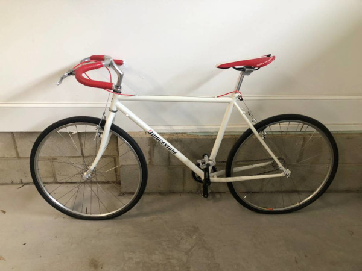
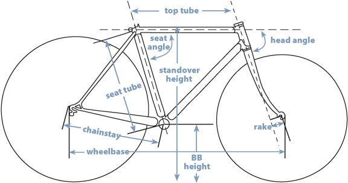
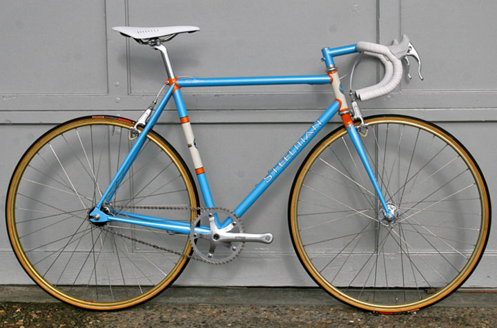
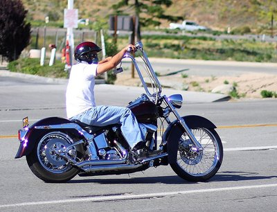
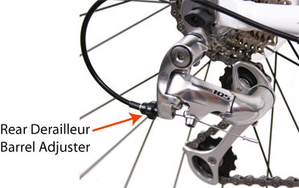

#### TLDR;
1. Find your frame size using [this chart](https://www.evanscycles.com/en-us/help/bike-sizing-road)
2. Visit [craigslist bicycles](https://raleigh.craigslist.org/search/bia?hasPic=1&bundleDuplicates=1&searchNearby=2&nearbyArea=367&nearbyArea=335&nearbyArea=273&nearbyArea=61&nearbyArea=634&nearbyArea=272&min_price=90&max_price=500) (I have the filters set up for you)
	- Click the X on bikes that are too big or too small for you. Also X anything that [looks like what you'd see in Target or Walmart.](http://www.randomthoughts.fyi/2012/01/buying-bikes-from-craigslist.html) (More commonly you'll be clicking the X on weird bikes, or things that aren't bikes at all!)
3. Test ride 2-3 bikes near you and buy one.
	- People are constantly test riding bikes (especially the $200+ ones), so don't feel weird asking.
	- To be polite, trade your ID for a test ride so that the seller knows you won't steal the bike.

<figure>

<figcaption>A fixie (single gear) bike listed for $200 on Craigslist with mediocre comonents.</figcaption>
</figure>

# The Guide
I recently bought a bike after religiously checking Craigslist for a month, and I'd like to share the process I went through. I'm a huge fan of bikes and the [lifestyle they encourage.](http://www.mrmoneymustache.com/2011/04/18/get-rich-with-bikes/)

Luckily, buying used bikes ($100+) is easier than ever in the age of the internet. Unluckily, doing research is necessary or you'll end up buying a bike that doesn't fit, has a major problem, or maybe some other bothersome issue.

To make an informed decision about buying a used bike, you have to:

1. Find your size.
2. Understand you're actually investing in a frame. So understand different types of frames and what they're good at.
3. Understand wheels and other components (derailleurs, crank-sets, brakes, and shifters) and what makes them work.
4. Understand comfort (seat and handlebars).
5. Get a BicycleBlueBook quote.
6. With your newfound knowledge, inspect the bike!

If you do all of those things, I think you'll find yourself a bike that's a keeper just like I did!

## 1. Finding your size
Most non-department store bikes are measured by their [seat tube length.](https://www.evanscycles.com/help/bike-sizing) This determines how far your legs have to go to touch the pedals. The best way to find your frame size is to measure your inseam length (foot to crotch.) Find it by putting the spine of a book in your crotch and measuring from the floor to the top of the spine. Convert your inseam to cm. Multiply by .67. That's around the size bike you want. If you're too lazy to do all this, you can use this guesstimate chart.

<table class="table">
	<caption>Sizing chart</caption>
	<tbody>
		<tr>
			<th style="text-align: center" colspan="2">Rider Height</th>
		</tr>
		<tr>
			<th>Feet &amp; Inches</th>
			<th>Centimeters</th>
			<th colspan="2">Frame Size (cm)</th>
		</tr>
		<tr>
			<td>4'10" - 5'0"</td>
			<td>148 - 152</td>
			<td>47 - 48</td>
		</tr>
		<tr>
			<td>5'0" - 5'3"</td>
			<td>152 - 160</td>
			<td>49 - 50</td>
		</tr>
		<tr>
			<td>5'3" - 5'6"</td>
			<td>160 - 168</td>
			<td>51 - 53</td>
		</tr>
		<tr>
			<td>5'6" - 5'9"</td>
			<td>168 - 175</td>
			<td>54 - 55</td>
		</tr>
		<tr>
			<td>5'9" - 6'0"</td>
			<td>175 - 183</td>
			<td>56 - 58</td>
		</tr>
		<tr>
			<td>6'0" - 6'3"</td>
			<td>183 - 191</td>
			<td>58 - 60</td>
		</tr>
		<tr>
			<td>6'3" - 6'6"</td>
			<td>191 - 198</td>
			<td>61 - 63</td>
		</tr>
	</tbody>
</table>

	<a href="https://www.evanscycles.com/help/bike-sizing-road">Source</a>

The best option is to spend an afternoon at a nearby bike shop and test out different sizes.

<figure>

<figcaption>The parts of a normal bike frame.</figcaption>
</figure>

## 2. Understanding different frames
A frame is the core of the bike, and it determines all the other components you can use on it. If you're planning on maintenance or upgrades then you are really investing in a frame.

### [Steel (is real)](http://road.cc/content/buyers-guide/194720-18-best-steel-road-bikes-and-frames-%E2%80%94-great-rides-cyclings-traditional)

Steel is THE classic material used to make bikes. It's lightened by being "butted" in places the tube doesn't have to be thick.
<figure>

</figure>

- pro Super strong, so all the tubes will be the skinniest ([looks great!](https://www.google.com/search?q=steel+bike+frames&source=lnms&tbm=isch&sa=X&ved=0ahUKEwj587yNqc7YAhUwRN8KHf2UAz0Q_AUICygC&biw=950&bih=994))
- pro Easy to repair -- can literally bend the steel back into place and it's good to go
- pro Absorbs TONS of road shock for comfy rides
- con Tends to make the heaviest frames

### [Aluminum](https://www.bicycling.com/bikes-gear/trends/aluminum-frames-are-back-and-better-ever)
<figure>

</figure>

Aluminum is the modern material used to make bikes. Most bikes made post-1990 bikes are aluminum. It's not as strong as steel, so tubes have to be thicker to support the same weight.

- pro Tends to make lighter frames
- con Harder to repair bent frames, usually requires some welding
- con Doesn't absorb much road shock (ie. "stiff")

### [Carbon Fiber](http://road.cc/content/feature/211921-13-best-carbon-fibre-road-bikes-%C2%A3799-%C2%A310000)
<figure>

</figure>

Carbon Fiber has just started peeking its head in the consumer world around 2000. Like aluminum, it's not as strong as steel so tubes have to be thicker to support the same weight. Carbon fiber frames are more expensive to produce than aluminum, but in theory the best.

- pro Tends to make the lightest frames
- pro Absorbs a lot of road shock, almost as much as steel
- con Can't DIY repair the frame (they fail <a href="https://www.google.com/search?q=carbon+fiber+bike+crash&source=lnms&tbm=isch&sa=X&ved=0ahUKEwiy3YHk9M3YAhWBUN8KHQmqDfAQ_AUIDCgD&biw=950&bih=994">catastrophically</a> in crashes), need a professional

<figure>

<figcaption>This bike has a more racing geometry since the rider has to lean farther forward to reach the handlebars.
This is the same frame that I first bought (and love), a Cannondale CAAD 10!</figcaption>
</figure>

## 3. Understanding components
Components are... complicated. They've been letting you brake and shift gears since the inception of bicycles, but the way they do that has changed, and everyone has their own preferences. There are some globally agreed on facts, though:

1. Shimano groupsets (shifters + gears + brakes) are good. They are by far the most popular (at least in the US). Thankfully, their product lines follow a scale of worst to best AND are labeled on the derailleur of the bike.

<figure>

<figcaption>A dura-ace groupset.</figcaption>
</figure>

| Quality | Name							|
|---------|-------------------|
| Worst		| Shimano Claris		|
| Okay		|	Shimano Sora			|
| Good		|	Shimano Tiagra		|
| Good		|	Shimano 105				|
| Great		|	Shimano Ultegra		|
| Best		|	Shimano Dura-Ace	|

2. SRAM parts are good, but a little less popular [(and different)](http://road.cc/content/buyers-guide/206156-head-head-shimano-105-v-sram-rival-22-%E2%80%94-how-do-two-cheapest-11-speed)
3. Campy parts are amazing, but expensive

It's pretty hard to learn which components work well together with which, but thankfully bike manufacturers take care of that part for you. If you want to learn more about what each of those parts of your bike does, instead of watching hours of tutorials online like I did, buy [some cheap tools](https://www.amazon.com/s/ref=nb_sb_ss_c_1_9/140-5840151-4715015?url=search-alias%3Daps&field-keywords=bike+tool+kit&sprefix=bike+tool%2Caps%2C126&crid=38BYVW8P2CC4R) and get out there and actually [take apart a bike yourself!](http://www.jimlangley.net/wrench/wrench_images/bicycle_parts_labeled.jpg)

## 4. Understanding comfort
"Geometry" is the term we use to describe exactly how a bike positions its rider on the bicycle (think a Harley with high handlebars vs. a Tron bike).

<figure>

</figure>

vs

<figure>

</figure>

Every bike's geometry is different, so the only way to really know the geometries you like is to try different bikes! Faster bikes tend to have more aggressive and uncomfortable geometries that position the rider higher up and with a more straight back, but it all depends on the size of the person, so your mileage ***will*** vary.

Seats ($30), handlebars ($50), and handlebar tape ($10) are all really cheap to replace on a used bike, and add to comfort. You can take straight bars off a bike and put on curved road bars easily ($40).

## 5. BicycleBlueBook quotes
This is the best way to price-verify used bikes. All you have to do is look at the picture on Craigslist, and search the name of the manufacturer/model on Google followed by "blue book." Given the frame, components, age of the bicycle (and sometimes past sales), BicycleBlueBook gives a pretty accurate estimate of what any bicycle is actually worth. The MSRP (Manufacturer's Suggested Retail Price) is likely what the owner paid for it, so put that in context when making an offer.

## 6. Inspecting a bike
Remember: you're investing in a frame, you can't replace that! So inspect the frame thoroughly for any cracks (not in the paint), and question the owner endlessly if it was ever in a crash. If it was, don't buy it. You're risking your safety.

Inspect the wheels and make sure they have enough air (obviously). Ensure you can see the textures cut into the brake pads, and that the brakes work. Make sure the rims of the wheels where the brakes touch is similarly textured and not smooth.

Check the tension on the chain by pulling up or down on it. If it feels loose or comes out more than .75cm, the chain + gears are old and need to be replaced (you can't just replace the chain.) That's pretty expensive for a used bike you're just now buying, so I wouldn't buy it.

Check if the tires are true (no wobbling when they spin). If not, don't worry, you can tune the spokes yourself later.

While riding, you're looking for three things:

1. Does the frame absorb the road well?
2. Do I like the geometry of the bike? How long could I ride before becoming uncomfortable?
3. Do the gears change smoothly?
	- If you're skipping over gears, you can loosen the rear derailleur barrel to shift farther per click, or tighten it to shift less per click.
<figure>

</figure>
	- If you can't reach the highest of lowest gear, you can adjust screws on top of the derailleur to reach them. This is tedious, so just know it can be done.

### Conclusion
[Biking encourages frugal behavior,](http://www.mrmoneymustache.com/2012/05/07/what-do-you-mean-you-dont-have-a-bike/) and I can attest to their crazy usefulness. Bikes have close to zero-maintenance, and the little maintenance they have is cheap. Spending more money up front if you're going to be using the bike 2-3 years from now is totally worth it, and if you're in college you should be using a bike 2-3 years from now no matter if you're working or still in college.
